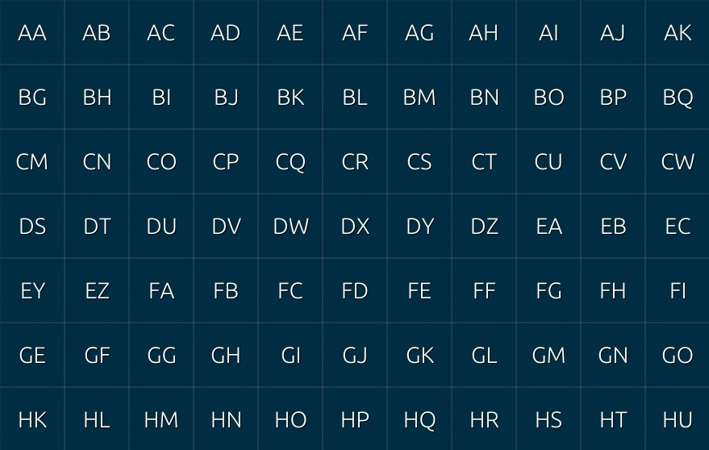
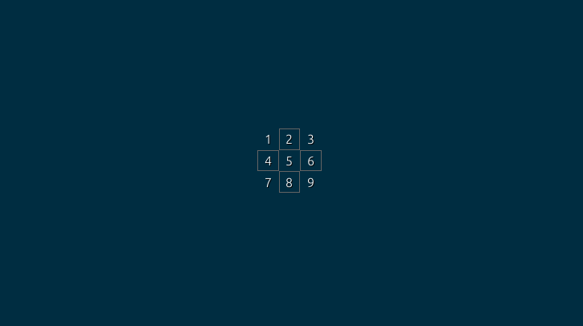

# Rust Keyboard Cursor
A lightweight utility written in Rust that lets you precisely control the mouse cursor using only the keyboard. It’s designed for fast, accurate mouse positioning without reaching for a physical mouse.

## Tech Stack

- **Rust** - core language
- **egui** - immediate-mode GUI
- **eframe** - application framework for egui
- **enigo** - cross-platform input simulation

## Installation

Download the executable from the [Releases](https://github.com/FrederikNorlyk/rust-keyboard-cursor/releases) page.

## Usage

It’s recommended to launch the executable via your preferred macro or hotkey program (for example, **AutoHotkey** or **Microsoft PowerToys**).

Using Rust Keyboard Cursor consists of two stages:

### Main Grid
When launched, a full-screen grid is rendered. Each cell is labeled with a two-letter key combination (from `AA` to `ZZ`, depending on your screen resolution).

Pressing one of these key combinations instantly moves the mouse cursor to the center of the selected grid cell and transitions to the second stage.

### Sub Grid
A smaller 3×3 grid appears inside the selected area, labeled with the numbers `1` through `9`.

Pressing a number key will click the mouse in the center of the corresponding sub-cell.

This stage also supports fine-grained cursor movement for extra precision.

### Keybinds

- **Escape** - Closes the application
- **Space** - Click at the current cursor position
- **Arrow keys / `h` `j` `k` `l`** - Gradually move the cursor while the sub grid is visible (useful for fine adjustments)
- **Shift (hold)** - Increase cursor movement speed while using gradual movement
